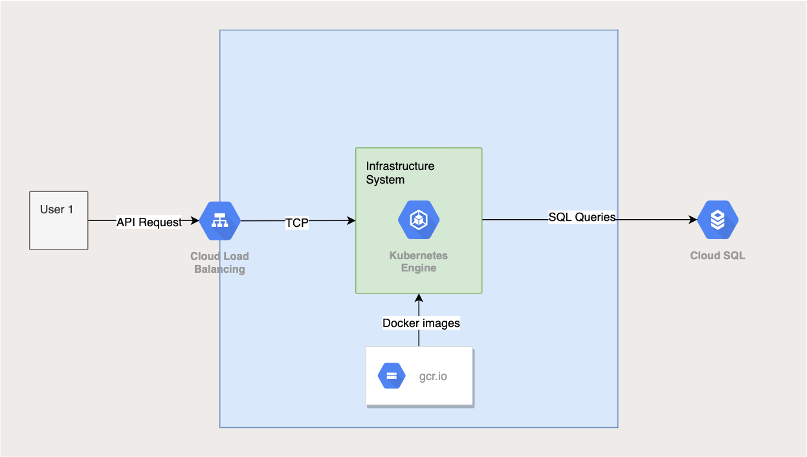

# Test Go helloAPI GCP Deployment. 
## Introduction.  
This demo shows how to connect example Golang application in Kubernetes Engine to
a Cloud SQL instance using the [Cloud SQL Proxy library](https://github.com/GoogleCloudPlatform/cloudsql-proxy).  
First we will deploy a [Kubernetes Engine](https://cloud.google.com/kubernetes-engine/)
cluster and a [Cloud SQL](https://cloud.google.com/sql/docs/) Postgres instance
and the Golang test app container.  



## Dependencies  
### Docker*:  
  - [Ubuntu](https://docs.docker.com/engine/installation/linux/docker-ce/ubuntu/#install-docker)  
  - [Windows 10](https://docs.docker.com/docker-for-windows/)  
  - [Mac OS X](https://docs.docker.com/docker-for-mac/install/); [DMG Download URL](https://download.docker.com/mac/stable/Docker.dmg)  
  **For local development*

### Gcloud:
  - [Ubuntu](https://cloud.google.com/sdk/docs/quickstart-debian-ubuntu)
  - [Windows](https://cloud.google.com/sdk/docs/quickstart-windows)
  - [Mac OS X](https://cloud.google.com/sdk/docs/quickstart-mac-os-x)

## Gcloud  
This tutorial assumes you have access to the [Google Cloud Platform](https://cloud.google.com) and you already have initialized `gcloud` with default project, region and zone set. Otherwise, do the following steps:  
- `gcloud init`  
- Enter your email address,  
- Choose your project or create a new one,  
- `gcloud config set compute/zone ZONE`   
- `gcloud config set compute/region REGION`  
ZONE and REGION list could be found here:  
`gcloud compute zones list`  

If you don't have a Google Cloud account you can sign up for a [free account](https://cloud.google.com/).

## Kubectl  
It's better to install a fresh version of `kubectl` with `gcloud`:  
`gcloud components install kubectl`

## Usage
All deployment processes are fully automated. The main entry point here is `make.sh` bash-script (in case if someone doesn't have `make` installed). There are some options:
``` 
Usage: ./make.sh option"
Options: docker-build, -- run docker-compose up -d --build
         docker-cleanup -- run docker-compose down & system prune"
         gcp-build (optional flag: -t v0.x.x), -- build Docker image and push to gcr.io"
         gcp-create, -- run GCP provisioning and deployment"
         gcp-destroy, -- destroy GCP resorces"
```

## Demo:
### Local  
Run docker-compose deployment and tests locally:  
`./make.sh docker-build`  
### Remote GCP  
Run GCP full infrastructure deployment:  
`./make.sh gcp-create`  
Build docker image with new tag and push to gcr.io:  
`./make.sh -t 0.1.11 gcp-build`  
Run deployment with new tag and scaled with 3 replicas:  
`./make.sh -t 0.1.11 -c 3 gcp-deploy`  

### Cleanup  
`./make.sh docker-cleanup`  
`./make.sh gcp-destroy`

### ToDo
- Unit tests.
- Jenkinsfile?
- Terraform?
- Helm chart?
- Monitoring?
